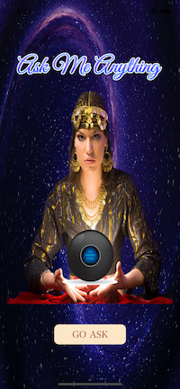

# Magic 8 Ball

## Project Description

This project is a single base application that allows the user get an answer from a magic ball at the press of a button.

## Technologies Used

1. XCode 13 - IDE
2. Swift 5 - Programming Language
3. UIKit - Interface Builder

## Sample Look

## Credits

* Launchscreen logo created from ***www.canva.com***
* Fortune Teller image: ***https://www.istockphoto.com/photo/fortune-teller-gm149060570-9642815***
* Ball Images: ***Angela Yu's Magic8Ball-IOS13 Project***
* Ask Me Anything Logo generated from ***www.flamingtext.com***

## Notes

This is a companion project to The App Brewery's Complete App Development Bootcamp, check out the full course at [www.appbrewery.co](https://www.appbrewery.co/)

